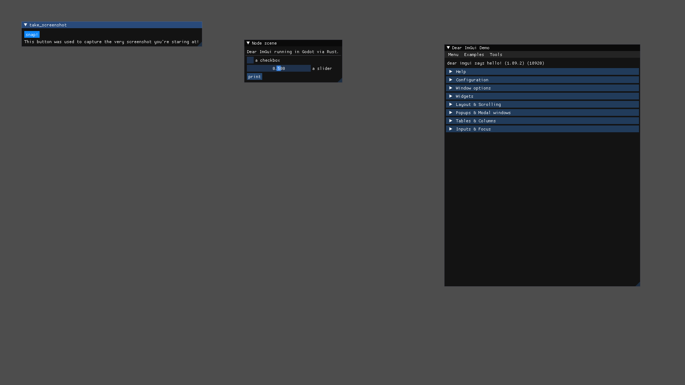

# dear-imgui-godot

Fully-featured Dear ImGui plugin for Godot 4 with [imgui-rs](https://github.com/imgui-rs/imgui-rs) backend.

<p align="center">
  <a href="https://github.com/shatadev/dear-imgui-godot/actions/workflows/build.yml">
    </a>
  <a href="https://godotengine.org">
    </a>
  <a href="https://opensource.org/licenses/MIT">
    </a>
</p>

<p align="center">
  
</p>

# Supports

- Editor: Godot 4.3+
- Language: GDScript, C#, Rust
- Platform: Windows, Linux, macOS, Web

# Why Rust instead of C++?

Most are already familiar with [pkdawon's imgui-godot](https://github.com/pkdawson/imgui-godot) addon, which uses C++ GDExtension. My original goal was to add web support to that addon, but dependencies were outdated and the project appears to be abandoned. I happen to prefer [godot-rust](https://github.com/godot-rust/gdext) for GDExtension development, so I opted for a more direct bridge with [imgui-rs](https://github.com/imgui-rs/imgui-rs) instead.

# Usage - GDScript

`ImGui` is a global Node (`ImGuiApi` class). Build UI inside its per-frame `imgui_layout` signal (emitted from Rust):

```gdscript
func _ready() -> void:
    ImGui.imgui_layout.connect(self._on_layout)

func _on_layout() -> void:
    if ImGui.begin("Window"):
        ImGui.text("hello")
        if ImGui.button("ok", 0.0, 0.0):
            print("clicked")
    ImGui.end()
```

# Usage - C#

On the .NET build of Godot, drive the same API from C# via the static `ImGui` wrapper (`addons/dear-imgui-godot/dotnet/ImGui.cs`). It mirrors the GDScript methods. Connect a handler with `ImGui.OnLayout` to build UI.

```csharp
using Godot;inside

public partial class ImGuiExample : Node
{
    public override void _Ready() => ImGui.OnLayout(OnLayout);

    private void OnLayout()
    {
        if (ImGui.Begin("Window"))
        {
            ImGui.Text("hello");
            if (ImGui.Button("ok"))
                GD.Print("clicked");
        }
        ImGui.End();
    }
}
```

# Usage - Rust

For complete imgui-rs API access, build UI in Rust with `with_ui`, called from a handler connected to `imgui_layout`.

```rust
use godot::prelude::*;
use crate::with_ui;

#[godot_api]
impl ImGuiExample {
    #[func]
    fn on_layout(&mut self) {
        with_ui(|ui| {
            ui.window("Rust window").build(|| {
                ui.text("the entire imgui-rs API is available here");
                // ui.slider(...), ui.plot_lines(...), ui.input_text(...), etc.
            });
        });
    }
}
```

# Installation

## 1. Release Download

Download latest [release](https://github.com/shatadev/dear-imgui-godot/releases)

Copy or extract `dear-imgui-godot/` into your project's `addons/` folder.

Enable **Dear ImGui Godot** in _Project Settings → Plugins_. The plugin registers the `ImGui` global on enable. This autoload **must remain enabled in order for the API to work.** The plugin prints a warning if the autoload or plugin is not enabled.

### C# setup

The wrapper lives at `addons/dear-imgui-godot/dotnet/ImGui.cs` and is compiled into the project assembly automatically by the .NET SDK's default `**/*.cs` glob.

1. If the project has no C# code yet, create the solution once: **Project → Tools → C# → Create C# solution**.
2. Enable the plugin and rebuild the project to get started.

Notes:

- The C# methods match the GDScript methods. Complete imgui-rs API access (`with_ui`) is Rust-only.
- `ImGui` is a global type for parity with GDScript. If it collides with another `ImGui` (e.g. ImGui.NET), alias it with a `using`.
- If your project sets `<EnableDefaultCompileItems>false</EnableDefaultCompileItems>`, add `addons/dear-imgui-godot/dotnet/ImGui.cs` to your compile items manually.

# Compiling

- Rust nightly pinned in `imgui/Makefile`. This is the latest known working version with the configuration required to compile to wasm targets.
- A C++ compiler (imgui-sys builds Dear ImGui + cimgui via the `cc` crate).
- For web targets: the emscripten SDK (`emcc` on `PATH`, `EMSDK` set).

```sh
cd imgui # crate
make all
```

No Godot binary is needed at build time. The crate uses gdext's bundled `api-4-3`.

# TODO

- GDNative 3.x
- Extension chaining for better imgui-rs API access

# Alternatives

[imgui-godot](https://github.com/pkdawson/imgui-godot) by pkdawson

# Credits

https://github.com/pkdawson/imgui-godot

Built on [imgui-rs](https://github.com/imgui-rs/imgui-rs)

See [LICENSE](https://github.com/shatadev/dear-imgui-godot/blob/main/LICENSE).
